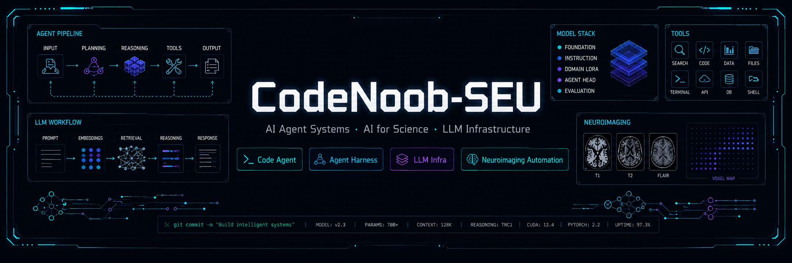

<!--Banner-->

<!--Night Owl image-->

  

<!--Header Name-->
# Hi, I'm CodeNoob-SEU 👋
*Agentic Systems Builder (Master's Student / Developer)*
  

<!--Start Intro-->               

I am a master's student interested in AI Agent systems, LLM infrastructure, AI for Science, and neuroimaging automation.

- 🔭 Currently building **Code Agent Harness**, **Issue-to-PR Agent**, and **NeuroImgAgent / NeuroAgentBench**.
- 🌱 Exploring **tool-using agents**, **hybrid code retrieval**, **agent runtime**, and **benchmark-driven evaluation**.
- 🧠 Interested in **AI for Science**, **neuroimaging automation**, **fMRI workflows**, and **scientific computing**.
- 🔧 I care about **tracing**, **sandbox execution**, **failure recovery**, **token/runtime profiling**, and **reproducibility**.
- ❤ Open to open-source collaboration, technical discussions, and practical AI system building.
<!--End Intro-->

---

<!--Languages and Tools Section-->       
<h2 align="center">Tᴇᴄʜ sᴛᴀᴄᴋ</h2> 
<h3 align="left">Languages</h3>

  
  
  

<h3 align="left">Agentic AI & Retrieval</h3>

  
  
  
  
  
  
  

<h3 align="left">Backend & Data</h3>

  
  
  
  
  
  

<h3 align="left">Tools</h3>

  
  
  
  
  
  

<!--Footer--> 

  

